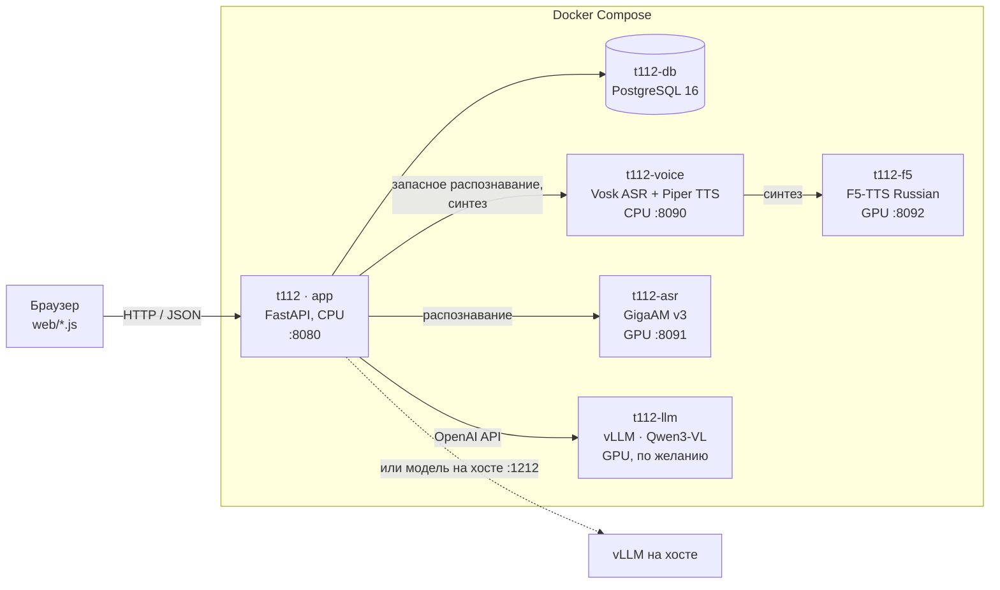
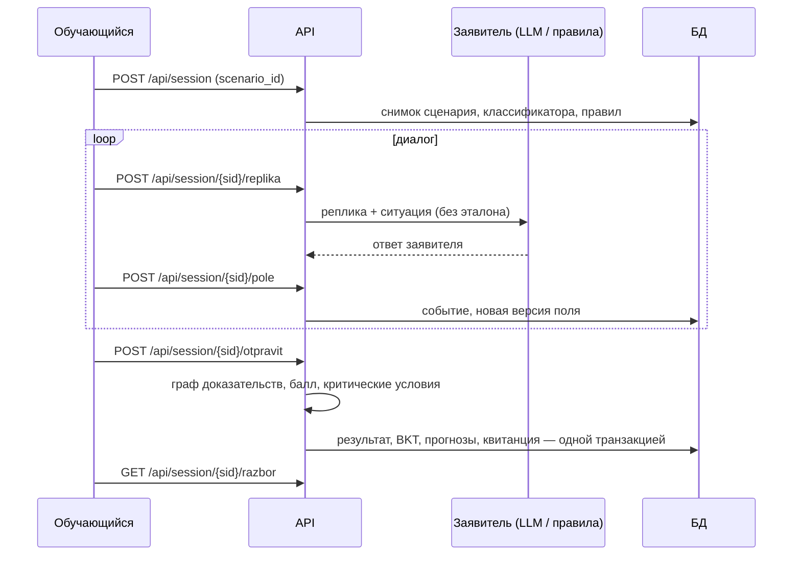

# Архитектура

## 1. Назначение и принципы

Тренажёр моделирует два рабочих места:

| Режим | Обучаемый | Задача |
|---|---|---|
| **Приём вызова 112** | оператор 112 | принять вызов, добиться точного адреса, классифицировать происшествие, назначить службы, уложиться в норматив |
| **Диспетчер ДДС** | диспетчер службы | подтвердить приём карточки за 30 с, найти ошибку оператора 112 по записи разговора, передать сведения бригаде по IP-телефону, ставить статусы только по факту докладов |

Архитектурные принципы, которые определяют устройство системы:

1. **Оценка не зависит от нейросети.** Все критерии считаются детерминированными правилами и
   сверяются с эталоном билета или классификатором. У каждого факта есть ссылка на норму
   (ПП РФ № 1931, приказ МЧС № 192, памятка ГБУ «Система 112», методика МЧС).
2. **Постепенная деградация.** Языковая модель, распознавание и синтез речи — внешние сервисы.
   При их отсутствии заявитель отвечает по правилам, работает текстовый ввод, занятие не прерывается.
3. **Нормативы — в конфигурации.** Сроки, статусы ДДС, типы ошибок, службы и правила речи вынесены
   в `api/config.py` и `data/`; изменение норматива не требует правки логики.
4. **Воспроизводимость.** Попытка хранит снимки сценария, классификатора и правил, действующих на
   момент старта, журнал событий и квитанцию завершения. Разбор старой попытки не меняется при
   обновлении рубрики.
5. **Офлайн-работа.** После сборки образов сеть не нужна: модели лежат в образах и на диске сервера.

## 2. Компоненты

| Контейнер | Образ | Назначение | Ресурс | Профиль Compose |
|---|---|---|---|---|
| `t112-db` | `postgres:16-alpine` | пользователи, сценарии, попытки, события, аудит | CPU | всегда |
| `t112` | `Dockerfile` (python:3.12-slim) | API, интерфейс, оценка, аналитика, отчёты | CPU | всегда |
| `t112-voice` | `voice/Dockerfile` | Vosk (запасной ASR), Piper; синтез проксирует в F5, при отказе — Piper | CPU | всегда |
| `t112-asr` | `asr/Dockerfile` (PyTorch 2.6 + CUDA 12.4) | GigaAM v3 e2e-RNNT — основной ASR | GPU | `gpu` |
| `t112-f5` | `tts/Dockerfile` | F5-TTS Russian, голоса заявителей и звуковые сцены | GPU | `gpu` |
| `t112-llm` | `vllm/vllm-openai` | Qwen3-VL, если модели нет на хосте | GPU | `llm` |

Цепочки отказоустойчивости:

- **Распознавание:** GigaAM → Vosk → текстовый ввод. Режим задаётся `ASR_ENGINE=auto|gigaam|vosk`.
- **Синтез:** F5-TTS → Piper → текст без звука.
- **Заявитель:** LLM → ответы по правилам (`api/caller.py`).

## 3. Серверная часть (`api/`)

Приложение — один процесс Uvicorn с одним worker. Маршруты подключаются из основного модуля и
роутеров.

| Модуль | Ответственность |
|---|---|
| `main.py` | приложение FastAPI, вход, пользователи и группы, сценарии, назначения, занятия режима 112, аналитика, отчёты, администрирование, прокси речи, раздача интерфейса |
| `dds.py` | режим «Диспетчер ДДС»: генерация карточки с возможной ошибкой оператора 112, запись разговора, IP-телефон, входящие доклады бригады по таймеру, статусы, завершение |
| `dds_rules.py` | рубрика ДДС v2: допустимые ветви, исключения для медицинской службы, применимость проверок |
| `domain.py` | ядро оценки 112: сверка адреса, граф доказательств, прогноз внутри вызова |
| `quality.py` | консервативные проверки: разбор адреса по компонентам (дом/корпус/строение не взаимозаменяемы), программы навыков, версия рубрики |
| `facts.py` | извлечение фактов из реплик: пострадавшие, отрицания, «нет данных» |
| `legacy_domain.py`, `legacy_quality.py`, `legacy_scoring.py` | замороженные оценщики для попыток, начатых до обновления рубрики |
| `caller.py` | виртуальный заявитель; точный адрес выдаётся только на прямой уточняющий вопрос |
| `generator.py`, `scenario_tools.py` | черновики сценариев по классификатору; эталон типа и служб берётся из классификатора, модель придумывает только обстоятельства; публикация — после утверждения преподавателем; правка создаёт неопубликованную копию |
| `ai_text.py` | ограниченный адаптер структурированных ответов LLM |
| `helper.py` | подсказки обучающемуся по запросу: видимые источники, явное принятие/отклонение, версии полей |
| `bkt.py` | байесовское отслеживание знаний (BKT) по навыкам, раздельно для программ 112 и ДДС |
| `forecast_ml.py` | необязательная логистическая модель прогноза «успеет ли карточка до порога»; по умолчанию выключена |
| `insights.py`, `analytics.py`, `report_analytics.py` | персональная и групповая аналитика, неизменяемые снимки для графиков, PDF и Excel |
| `reports.py` | отчёт о занятии (PDF), сертификат (PDF), выгрузка (Excel), формы 1/112 и 2/112 |
| `lessons.py` | жизненный цикл группового занятия и выдача карточек по серверному времени, планировщик |
| `training.py` | возобновление, наблюдения, вмешательство преподавателя, изолированный повтор |
| `curriculum.py` | метаданные сценариев, политика занятия, объяснимый подбор следующей практики |
| `materials.py` | версионируемые учебные материалы, локальное извлечение текста |
| `session_store.py` | долговременное состояние попыток, атомарные команды, снимки, идемпотентное завершение |
| `access.py` | серверные области видимости по ролям и группам |
| `auth.py` | пароли PBKDF2-SHA256, подписанные HMAC токены, проверка ролей |
| `db.py`, `migrations.py` | доступ к PostgreSQL/SQLite, транзакции, блокировки строк, миграции, резервные копии |
| `config.py` | нормативы, правила речи, направления реагирования, навыки, настройки ДДС |

## 4. Интерфейс (`web/`)

Одностраничное приложение без сборки. `index.html` подключает скрипты из `/static/`:

| Файл | Назначение |
|---|---|
| `network.js` | транспорт: токен, заголовок `Idempotency-Key`, очередь команд попытки в `localStorage` с повторной отправкой при обрыве связи |
| `app.js` | вход, роли, режим 112, карточка, классификатор, микрофон и воспроизведение |
| `dds.js` | рабочее место диспетчера ДДС: таймер подтверждения, запись разговора, телефон, статусы |
| `workspace.js`, `integration.js` | рабочая область преподавателя и администратора, занятия, подсказки |
| `insights.js`, `charts.js` | прогресс обучающегося и графики аналитики |
| `style.css`, `workflow.css` | оформление в стиле АРМ «Система 112» |

Интерфейс ходит в API по тому же адресу, с которого загружен, поэтому отдельный веб-сервер не нужен.

## 5. Данные (`data/`)

| Файл | Содержимое |
|---|---|
| `tree.json`, `index.json` | классификатор происшествий v0.46.24, 1283 позиции, признаки и условная маршрутизация |
| `bilety.json` | 96 учебных вызовов из билетов, 22 из них с эталонным адресом, требующим уточнения |
| `sluzhby.json` | 193 службы Москвы |
| `chto_sluchilos.json` | 51 тип «Что случилось» из АРМ |
| `classifier.json`, `manifest.json` | служебные метаданные и контрольные суммы исходников |

Файлы генерируются скриптом `build_bilety.py` и руками не редактируются. При первом запуске билеты
загружаются в таблицу `scenarios` как опубликованные сценарии.

## 6. Модель данных

Схема создаётся при старте приложения (`db.py`) и дополняется аддитивными миграциями
(`migrations.py`, таблица `schema_migrations`). Выпущенные миграции не редактируются.

| Таблица | Содержимое |
|---|---|
| `users`, `groups`, `teacher_groups` | пользователи, учебные группы, группы, доступные преподавателю |
| `scenarios`, `scenario_revisions` | сценарии (билеты и сгенерированные) и история их правок |
| `assignments` | назначения группе: режим, служба, лимит времени, срок |
| `lessons`, `lesson_members` | групповые занятия и их участники |
| `sessions`, `session_snapshots` | попытки (состояние в JSON) и периодические снимки |
| `session_events` | упорядоченный журнал действий попытки |
| `completion_receipts` | сохранённый ответ завершения — повторный запрос получает тот же результат |
| `command_receipts` | квитанции команд по заголовку `Idempotency-Key` |
| `evidence_reviews` | пересмотры критериев преподавателем с причиной; исходная оценка сохраняется |
| `content_versions` | снимки сценария, классификатора и правил по хешу |
| `forecasts`, `bkt` | прогнозы и состояние освоения навыков |
| `helper_proposals` | предложения помощника и решения по ним |
| `materials`, `analytics_snapshots` | учебные материалы и снимки аналитики |
| `audit`, `settings` | журнал аудита и настройки, изменяемые администратором |

Основная СУБД — PostgreSQL 16 (`DATABASE_URL`). Если переменная не задана, используется SQLite-файл
`DB_PATH` — так работают локальный запуск и тесты.

## 7. Жизненный цикл попытки

### Режим 112

### Режим ДДС

1. Система, играя оператора 112, «поставляет» карточку в службу обучаемого. В упражнении
   «Проверка карточки» (`exercise_profile=card_check`) с вероятностью 0,7 в неё внесена ошибка:
   номер дома, корпус, телефон или признак пострадавших. В стандартном упражнении карточка верна.
2. Диспетчеру доступна запись исходного разговора, в которой содержатся верные сведения.
3. Диспетчер подтверждает приём (норматив 30 с), отмечает расхождения, звонит бригаде.
   Без адреса бригада не выезжает.
4. После выезда по таймеру (`DDS_ETAPY_SEC`) старший бригады звонит с докладами: прибытие, начало
   работ, завершение. Каждый доклад — основание для соответствующего статуса.
5. Статус, поставленный без основания, система принимает, но в оценке он не засчитывается.

## 8. Оценка

- **Граф доказательств.** Каждый критерий — факт с результатом, объяснением, ссылкой на норматив и
  событием журнала, на котором он основан.
- **Программы навыков.** 112: адрес, тип, службы, тайминг, полнота, речь. ДДС: подтверждение,
  проверка карточки, передача, статусы, речь, грамматика.
- **Порог и критические условия.** Порог — 70 баллов. В режиме 112 обязательны адрес, тип, службы и
  полнота; в ДДС — подтверждение, проверка карточки, передача, обоснованность статусов и завершение.
  Высокий балл не отменяет критическую ошибку; ручная правка балла преподавателем тоже её не скрывает.
- **Адрес** сверяется по компонентам. Если структура адреса не распознана, система требует пересмотра
  преподавателем вместо нечёткого зачёта.
- **Речь** проверяется по методике МЧС: частица «не» в побуждениях, катастрофизаторы,
  непрофессиональные обороты. Если операторских реплик нет, речь помечается «не проверена».
- **Версии рубрики.** Текущая — `112-quality-2`. Попытки, начатые раньше, оцениваются замороженным
  оценщиком (`legacy_*`).
- **Пересмотр.** Преподаватель может пересмотреть конкретный критерий с обязательной причиной; создаётся
  новая ревизия, исходная оценка сохраняется, BKT соответствующей программы пересчитывается.

### Прогноз и освоение навыков

- **Внутри вызова** — эвристическая оценка вероятности отправить карточку до порога времени;
  после дедлайна прогноз равен нулю. Точность прогнозов проверяется фактом и показывается обучающемуся.
- **Опциональная ML-модель** (`forecast_ml.py`): логистическая регрессия с калибровкой Платта,
  хранится в JSON. Признаки описывают только то, что известно в момент прогноза. Обучение —
  `scripts/ml_export.py` и `scripts/ml_train.py`: хронологическое разбиение 60/20/20, минимум 200
  попыток, сравнение с базовой линией. Модель активируется только после явного одобрения.
- **BKT** — стандартная модель байесовского отслеживания знаний с неподобранными параметрами
  (P_init 0,1, P_learn 0,1, P_guess 0,25, P_slip 0,1, порог освоения 0,95). Отображается как
  состояние модели, а не как допуск к работе.

## 9. Надёжность и согласованность

- Изменения попытки выполняются короткими атомарными командами: в PostgreSQL — с блокировкой строки,
  в SQLite — в транзакции записи. Запросы к LLM выполняются вне транзакций.
- Завершение, BKT, результаты прогнозов и квитанция записываются одной транзакцией. Повторная отправка
  возвращает сохранённый ответ и не начисляет навыки второй раз.
- Заголовок `Idempotency-Key` для POST/PUT/PATCH/DELETE защищает от повторного выполнения команды.
- Поля карточки версионируются (`expected_version`), что исключает потерю изменений при
  одновременной правке.
- При старте активные попытки восстанавливаются из БД в кэш `LIVE`.
- Резервная копия всех таблиц — автоматически раз в сутки (`BACKUP_PERIOD_SEC`), хранится 14 копий;
  перед восстановлением делается страховочная копия.

**Ограничение:** кэш активных попыток живёт в памяти процесса, поэтому приложение работает строго в
одном worker и одной реплике. Горизонтальное масштабирование потребует переноса этого состояния.

## 10. Безопасность

- Пароли — PBKDF2-SHA256, 200 000 итераций, соль на пользователя.
- Токен — `uid:срок` с подписью HMAC-SHA256, срок жизни 12 ч (`TOKEN_TTL_SEC`). Ключ берётся из
  `SECRET_KEY` или создаётся в `state/app/secret.key` с правами 600.
- Роли `admin`, `teacher`, `trainee` проверяются на сервере для каждого маршрута; преподаватель видит
  только закреплённые за ним группы (`teacher_groups`). Обучающийся не может открыть чужую попытку.
- Эталоны (адрес, код, скрытые данные) не передаются клиенту до завершения попытки; ранний запрос
  разбора возвращает 409.
- Изменения оценок, входы и административные действия пишутся в журнал аудита.
- По умолчанию порт приложения открыт только на `127.0.0.1`; доступ — через SSH-туннель или HTTPS
  (`deploy/enable_tls.py` создаёт сертификат и конфигурацию nginx). Браузер даёт доступ к микрофону
  только на `localhost` или по HTTPS.
- Ответы API получают заголовки `X-Content-Type-Options: nosniff`, `Referrer-Policy: same-origin`,
  `Cache-Control: no-store`.

## 11. Нормативная база

- ПП РФ от 12.11.2021 № 1931 — 75 с на карточку, 30 с на подтверждение ДДС.
- Приказ МЧС России № 192 — формы отчётности 1/112 и 2/112.
- Памятка ГБУ «Система 112» для ДДС — статусы ставятся по факту получения информации.
- Методика МЧС России — требования к речи оператора.
- ТЗ ДГОЧСиПБ и ответы заказчика (сентябрь 2026).

## 12. Известные ограничения

- Один worker: долгий ответ LLM может увеличить задержку других запросов.
- Полного геокодера нет; необычный, но равнозначный адрес может потребовать пересмотра преподавателем.
- Смысл передачи сведений бригаде проверяется правилами, а не полноценным семантическим анализом.
- Службы по группе происшествия в режиме ДДС заданы упрощённо до получения опросных карт заказчика.
- Параметры BKT не обучены на реальных данных; обученной ML-модели в поставке нет.
